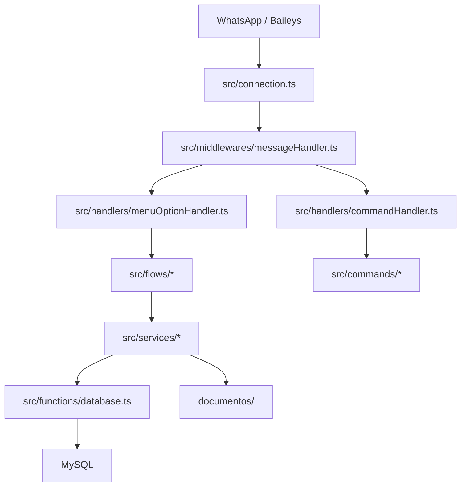
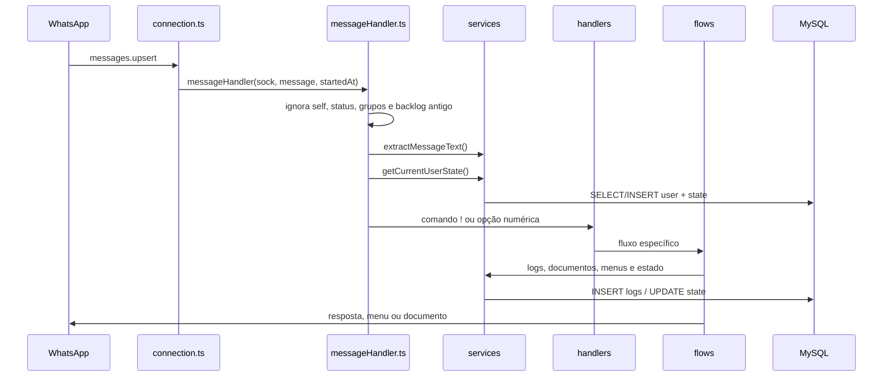

# Mapa do Código - FiraBot v7

Este documento descreve a arquitetura real observada no código TypeScript do FiraBot v7.

## Camadas

## Inicialização

`src/index.ts` é o ponto de entrada:

1. Carrega e valida configuração com `validateConfig()`.
2. Registra horário de início em runtime.
3. Checa conexão com MySQL usando `checkDatabaseConnection()`.
4. Atualiza status interno do banco.
5. Registra handlers para `SIGINT` e `SIGTERM`.
6. Chama `startBot()` em `src/connection.ts`.

`src/connection.ts`:

- abre sessão Baileys em `auth/`;
- busca versão atual do WhatsApp Web;
- gera QR Code quando necessário;
- atualiza status do WhatsApp;
- agenda reconexão com timer único;
- encaminha `messages.upsert` para `messageHandler`.

## Fluxo De Mensagem

Ordem de decisão em `messageHandler.ts`:

1. Ignora mensagens inválidas, status broadcast, mensagens do próprio bot, grupos bloqueados e mensagens antigas.
2. Extrai texto.
3. Busca estado atual do usuário.
4. Se começar com `!`, envia para `processCommand`.
5. Se for `encerrar`, encerra atendimento.
6. Aplica anti-spam.
7. Se for número, envia para `processMenuOption`.
8. Se for saudação/início, reinicia atendimento no menu principal.
9. Se o estado for `suporte`, registra mensagem livre.
10. Caso contrário, envia fallback contextual.

## Pastas Principais

### `src/commands`

Comandos técnicos com prefixo `!`:

- `help.ts`: lista comandos e explica uso básico.
- `ping.ts`: verifica se o bot responde.
- `status.ts`: mostra status de WhatsApp, banco, documentos e debug.
- `ifma.ts`: informações úteis do campus.
- `oi.ts`: atalho técnico para abrir o menu.

O carregamento é dinâmico via filesystem em `src/handlers/commandHandler.ts`.

### `src/handlers`

- `commandHandler.ts`: interpreta comandos com `!`, aliases e comandos desconhecidos.
- `menuOptionHandler.ts`: roteia números conforme estado atual e trata `0` como retorno ao menu principal fora do estado `main`.

### `src/flows`

Camada central da regra conversacional:

- `conversationFlow.ts`: boas-vindas, menu principal, follow-up, fallback e encerramento.
- `mainMenuFlow.ts`: opções 1 a 7 do menu principal.
- `documentsFlow.ts`: seleção DRCA/CAE e envio de documentos DRCA.
- `courseFlow.ts`: seleção de curso e envio de PPC.
- `documentSendFlow.ts`: envio rastreado de PDF com logs e follow-up contextual.
- `supportFlow.ts`: abertura do suporte e registro de mensagem livre.

### `src/services`

Serviços reutilizáveis:

- `menuRoutingService.ts`: mapeia opção + estado para rota de menu.
- `userStateService.ts`: normaliza, busca e salva estado com fallback em memória.
- `documentService.ts`: carrega documentos, monta menu, valida arquivo e envia PDF.
- `courseDocumentService.ts`: carrega PPCs por estado/curso.
- `logService.ts`: logs técnicos e persistência de eventos do atendimento.
- `messageGuardService.ts`: normalização de texto, saudação, comandos e backlog antigo.
- `messageTextService.ts`: extrai texto/caption de mensagens Baileys.
- `spamGuardService.ts`: anti-spam simples por chave usuário + texto.
- `runtimeStatusService.ts`: status em memória para `!status`.
- `followUpMenuService.ts`: monta continuação contextual após envio de documento.

### `src/menus`

Menus declarativos:

- `mainMenu.ts`: menu principal 1 a 7.
- `docsMenu.ts`: documentos DRCA fallback e menu DRCA/CAE.
- `courseMenu.ts`: cursos, estados e PPCs fallback.
- `noticesMenu.ts`: editais IFMA hardcoded.
- `types.ts`: `UserState`, `MenuOption` e `MenuDefinition`.

### `src/functions`

- `database.ts`: pool MySQL, healthcheck, criação/busca de usuário, estado, logs e documentos ativos.

## Pontos Fortes Da Arquitetura

- `messageHandler.ts` hoje é mais orquestrador do que arquivo monolítico.
- Estados aceitos são tipados e normalizados.
- O roteamento por estado evita confundir opções de submenu com opções do menu principal.
- Queries usam `pool.execute`, reduzindo risco de SQL injection.
- Logs técnicos mascaram telefone/JID e removem chaves sensíveis conhecidas.
- O envio de documento valida existência antes de mandar arquivo.
- O fallback de estado em memória reduz impacto de indisponibilidade temporária do banco.

## Pontos De Atenção

- `src/functions/database.ts` ainda mistura acesso a usuário, estado, logs e docs em um único arquivo.
- Não há migrations incrementais; `schema.sql` é o ponto único do schema.
- `USER_STATE_TTL_MINUTES` é configuração planejada, mas ainda não expira estados.
- `ADMIN_NUMBERS` é configuração futura, mas ainda não protege comandos administrativos.
- Caminhos de documentos vindos do banco devem ser restringidos antes de existir painel administrativo.
- Editais hardcoded podem ficar desatualizados.

## Como Adicionar Uma Nova Área De Menu

1. Criar ou atualizar uma definição em `src/menus/`.
2. Adicionar o estado em `src/menus/types.ts`.
3. Incluir o estado em `allowedStates` de `src/services/userStateService.ts`.
4. Ajustar `getMenuRouteForOption` em `src/services/menuRoutingService.ts`, se houver submenu.
5. Criar fluxo em `src/flows/`.
6. Roteá-lo em `src/handlers/menuOptionHandler.ts` ou `src/flows/mainMenuFlow.ts`.
7. Adicionar testes em `tests/run-tests.mjs`.
8. Atualizar `README.md` e docs relevantes.
